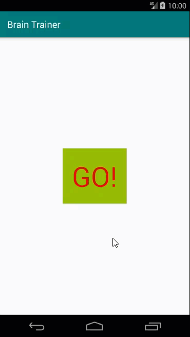

# Android App: Using Java

## Repository for my Brain Trainer Android game

Find out how to build a simple Brain Trainer game. Author Melvin Kisten tackles a CountDownTimer, Button, TextView, SecureRandom class and ArrayList class. 

## Instructions
1. Make sure you have these installed
	- [Android Studio](https://developer.android.com/studio#downloads)
2. Clone this repository into your local machine using the terminal (mac) or [Gitbash (PC)](https://git-scm.com/download/win)
	
	`> git clone https://github.com/iammelvink/brain-trainer.git`
3. Run Android Studio and choose Open an existing Android Sudio project
4. Press play button to run the app

## More Stuff
Check out some of my other stuff on [WiiLearnTech](https://www.wiilearntech.com). Follow me on [Twitter](https://twitter.com/iammelvink) and [Instagram](https://www.instagram.com/iammelvink/), or check out my [Youtube channel](https://www.youtube.com/channel/UCwMGEkyU2QOqEEKJ1E5pe7w).